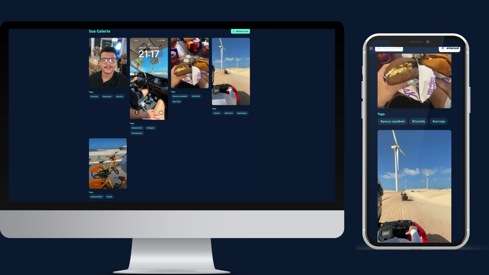

# PicSpace - AI-Powered Image Gallery

<div align="center">
  
</div>

PicSpace is a modern web application that leverages artificial intelligence to organize and manage your image gallery. Built with Next.js and featuring a beautiful, responsive design, it offers intelligent image tagging and efficient organization capabilities.



## Features

- 🤖 AI-powered image recognition and tagging
- 🎨 Modern, responsive UI with Framer Motion animations
- 🔍 Intelligent search functionality
- 🔒 Secure authentication system
- 📱 Mobile-first design
- 🎯 Efficient image organization

## Tech Stack

- **Frontend Framework**: Next.js 14 (App Router)
- **Styling**: Tailwind CSS
- **UI Components**: Shadcn/ui
- **Animations**: Framer Motion
- **State Management**: Zustand
- **Form Handling**: React Hook Form + Zod
- **API Integration**: SWR for data fetching
- **Package Manager**: Bun

## Prerequisites

- Node.js 18.x or later
- Bun (recommended) or npm/yarn
- AWS S3 bucket (for image storage)
- Environment variables configured

## Environment Variables

Create a `.env` file in the root directory with the following variables:

```env
NEXT_PUBLIC_API_URL=your_api_url
```

## Installation

1. Clone the repository:

```bash
git clone https://github.com/emanuellimamaia/picSpace-front
cd pic-space-front
```

2. Install dependencies:

```bash
bun install
```

3. Run the development server:

```bash
bun dev
```

4. Open [http://localhost:3000](http://localhost:3000) in your browser.

## Project Architecture

### Directory Structure

```
src/
├── app/
│   ├── (auth)/           # Authentication routes
│   ├── (home)/           # Home page
│   └── _modules/         # Feature modules
│       ├── auth/         # Authentication module
│       └── gallery/      # Gallery module
├── components/           # Shared components
├── hooks/               # Custom hooks
├── lib/                 # Utility functions
└── store/              # State management
```

### Key Components

- **Authentication Module**: Handles user sign-in and sign-up
- **Gallery Module**: Manages image upload, organization, and search
- **Custom Hooks**: Custom React hooks for common functionality

## Future Improvements

### Planned Features

1. **Enhanced AI Capabilities**

   - Object detection in images
   - Face recognition
   - Scene classification
   - Custom AI model training

2. **User Experience**

   - Drag-and-drop image upload
   - Bulk image operations
   - Image editing capabilities
   - Photo albums
   - Add Videos
   - Adit tags
   - Add Tags video

3. **Performance**

   - Image optimization and lazy loading

4. **Collaboration**
   - Shared galleries
   - User permissions
   - Comments and annotations
   - Real-time updates

### Technical Debt

1. **Testing**

   - Implement unit tests
   - Add integration tests

2. **Security**
   - Enhance error handling
   - Security audit

## License

This project is licensed under the MIT License - see the [LICENSE](LICENSE) file for details.
